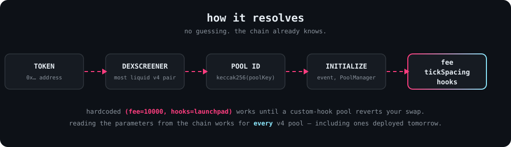

<div align="center">

# rh-v4-pool-discovery

[;you+cannot+reverse+it.+so+don%27t.;read+the+Initialize+event+instead;fee+%2F+tickSpacing+%2F+hooks+%E2%80%94+on-chain%2C+every+time)](https://git.io/typing-svg)

**Resolve Uniswap v4 pool parameters on Robinhood Chain — without guessing.**

<p>
  <a href="#-use"></a>
  <a href="#-robinhood-chain-specifics"></a>
  <a href="LICENSE"></a>
</p>

</div>



## Why This Exists

Most v4 tooling hardcodes `(fee=10000, tickSpacing=200, hooks=<launchpad>)`.
That works until it doesn't — the moment a token deploys with custom
parameters (a fee-taking hook, a zero-fee pool), every swap built on the
wrong key reverts, and the tooling blames the chain.

The chain already knows the answer. Every v4 pool emits an `Initialize`
event from the PoolManager at deployment carrying its real `(fee,
tickSpacing, hooks)`. This reads that event. It works for **any** v4 pool,
including ones deployed after this was written.

This is not a trading bot, not a router, not an SDK. It does one job:
turn a token address (or a pool ID) into the parameters you need to build a
correct swap. Stdlib only, no API keys, no dependencies.

## Robinhood Chain specifics

| | |
|---|---|
| PoolManager | `0x8366a39cc670b4001a1121b8f6a443a643e40951` |
| Initialize topic | `0xdd466e674ea557f56295e2d0218a125ea4b4f0f6f3307b95f85e6110838d6438` |
| WETH | `0x4200000000000000000000000000000000000006` |

> The Initialize topic on this fork is **not** the canonical Uniswap v4
> topic — it was derived from live chain logs. Porting to another chain
> means re-deriving the topic from that chain's PoolManager.

## Install

Python 3.8+. Nothing to install.

```bash
git clone https://github.com/<you>/rh-v4-pool-discovery.git
cd rh-v4-pool-discovery
```

## Use

**Look up a token** — finds its most liquid v4 ETH/WETH pair via DexScreener,
then discovers the on-chain params:

```bash
python rh_v4_pools.py 0xFb2BB4bfb97a796abFAe750113086b83173B0dcc
```

```json
{
  "ok": true,
  "pool_id": "0xb20f215e6b55ed39bc2376bc4d7fc4eabb2943fad0e0e3456a69869e1d4ce53a",
  "fee": 0,
  "tick_spacing": 200,
  "hooks": "0x75a54357d9c78a2db19004a5fdc76c50f9242aec",
  "dexscreener_url": "https://dexscreener.com/robinhood/0xb20f215e6b55ed39bc2376bc4d7fc4eabb2943fad0e0e3456a69869e1d4ce53a"
}
```

**Look up a pool ID directly** — skips DexScreener:

```bash
python rh_v4_pools.py --pool-id 0x04687a6021a2a91874fde89e5b4d22131b32468f78cf65e5bdf0b7f93b04f2cd
```

**As a library:**

```python
from rh_v4_pools import resolve_pool, discover_pool_params

pool, err = resolve_pool("0xFb2BB4bfb97a796abFAe750113086b83173B0dcc")
# pool -> {"pool_id": ..., "fee": 0, "tick_spacing": 200, "hooks": "0x..."}

fee, tick_spacing, hooks = discover_pool_params("0x04687a6021a2a91874fde89e5b4d22131b32468f78cf65e5bdf0b7f93b04f2cd")
```

When no route exists you get a plain reason, not a revert:

```json
{"ok": false, "error": "no liquid v4 ETH/WETH route (best quoted in GE)"}
```

## Configuration

| Env | Default |
|---|---|
| `RH_RPC_URL` | `https://rpc.mainnet.chain.robinhood.com` |

Results are cached in `.pool_params_cache.json` (override with `--cache`) —
repeat lookups never re-scan the chain. The RPC `eth_getLogs` window is 10M
blocks per call, scanning back ~90M blocks.

## License

MIT. Built for the Robinhood Chain agent economy.
